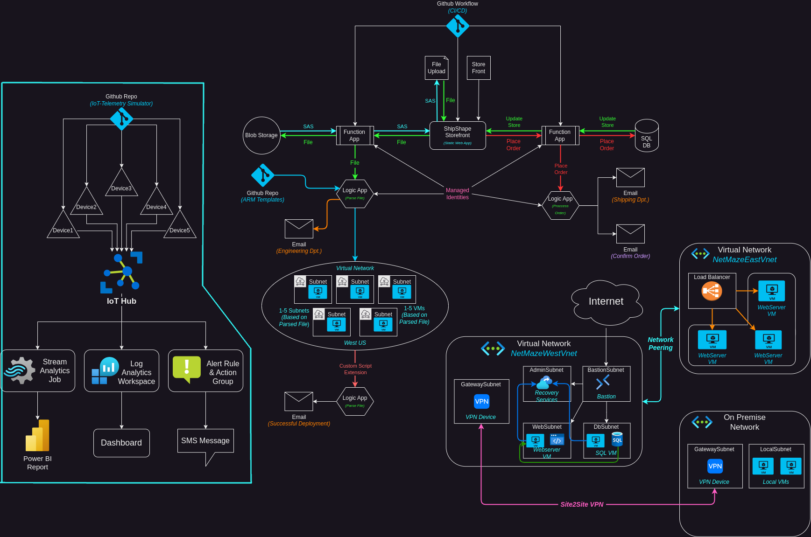

# IoTHub
Part of my AZ-104 Azure Administration project. In this section I set up an IoT Hub and simulate devices and telemetry. I use Log Analytics and Stream Analytics to monitor and visualize data from the devices. I also set up an alert and action group to fire off in specific scenarios. Stream Analytics sends telemetry to blob storage as well as to a Power BI workspace. I use Power BI to visualize data coming from the simulated devices. A Log analytics workspace is also used to query data about the devices.
### Topology
The topology for this section:

