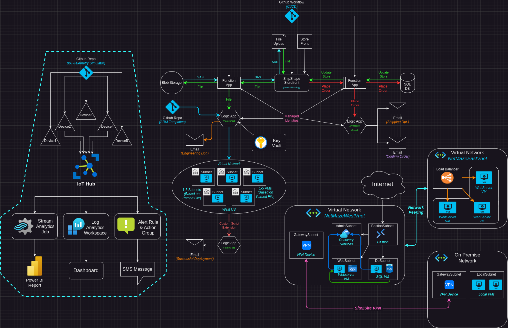

# Overview
***The full writeup can be found in the Writeup directory***

Part of my AZ-104 Azure Administration project. In this section I set up an IoT Hub and simulate devices and telemetry. I use Log Analytics and Stream Analytics to monitor and visualize data from the devices. I also set up an alert and action group to fire off in specific scenarios. Stream Analytics sends telemetry to blob storage as well as to a Power BI workspace. I use Power BI to visualize data coming from the simulated devices. A Log analytics workspace is also used to query data about the devices.

In this section of my Azure Administration project I set up an IoT Hub and simulate devices and telemetry. I use Steam and Log Analytics to monitor the devices. I want to get hands on experience with the skills learned and demonstrated in the [AZ-104 Azure Administration certification](https://learn.microsoft.com/en-us/credentials/certifications/azure-administrator/?practice-assessment-type=certification). This section will  focus on the *"Monitor and maintain Azure resources"* and *"Deploy and manage Azure compute resources"* section of the exam. 
## Summary
I created an IoT Hub with multiple simulated devices. I used the Azure [Raspberry Pi Simulator](https://azure-samples.github.io/raspberry-pi-web-simulator/) as well as the Azure [IoT Telemetry Simulator](https://github.com/azure-samples/iot-telemetry-simulator/tree/master/) to simulate telemetry from these devices. This telemetry gets monitored in a Stream Analytics Job that sends data to blob storage, as well as Power BI. Power BI is used to create powerful real time data visualizations for the incoming data.

The IoT Hub is also monitored by a Log Analytics workspace that can be used to monitor information like the connect/disconnect ratio of various devices, amount of error message thrown, and general activity levels of the devices.

I also set up an alert with an action group that will send out SMS messages to certain administrators when various conditions are met.
### Technologies Used
- Azure IoT Hub
- Azure [IoT Telemetry Simulator](https://github.com/azure-samples/iot-telemetry-simulator/tree/master/)
- Stream Analytics Jobs
- Power BI
- Log Analytics Workspace
- Alerts & Action Groups
### Topology
The topology for this section:

