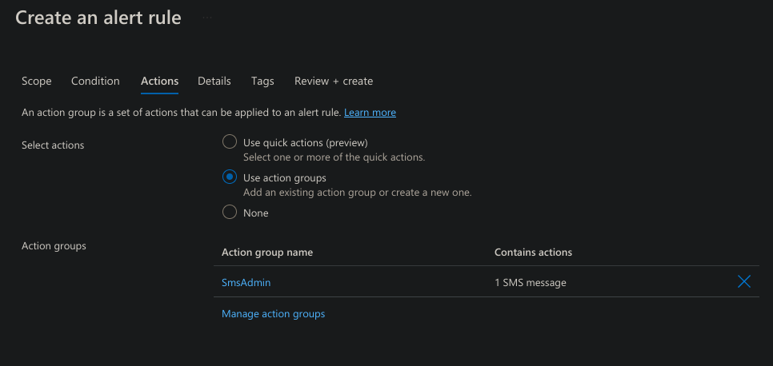
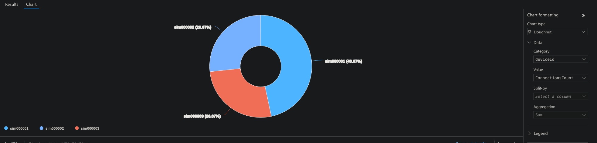
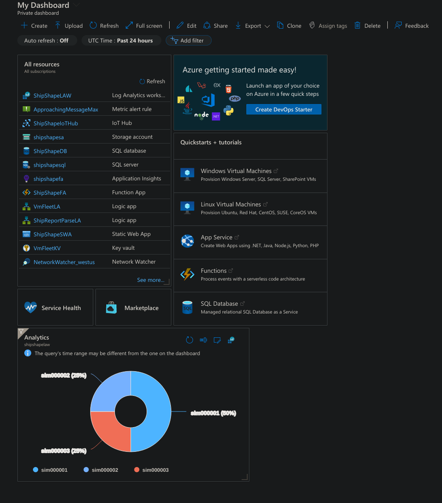

# Overview
In this section of my Azure Administration project, I want to showcase the setup of an Azure IoT Hub. I will do this by simulating IoT devices and telemetry. The devices will be monitored by a Stream Analytics Job, which will feed into blob storage and Power BI to create visualizations of the data. They will also be monitored by a Log Analytics workspace which will create a pie chart of active devices on my dashboard. I will also configure an alert rule and action group to send out SMS messages when certain conditions are met. This is part of my ongoing project for the [AZ-104 Azure Administration certification](https://learn.microsoft.com/en-us/credentials/certifications/azure-administrator/?practice-assessment-type=certification) to get hands on experience with different services and functions of the Azure cloud environment. This section will focus on the "Deploy and manage Azure compute resources" and "Monitor and maintain Azure resources" objectives of the certification.
## IoT Hub Creation
The first thing I need to do is set up a virtual network and subnet for my IoT hub and devices to live in. I create a resource group, vnet, network security group, and subnet with the Azure CLI.
```bash
# Create resource group
az group create --location westus --name ShipShapeIoT

# Create vnet
az network vnet create --name IoTVnet -g ShipShapeIoT --location westus --address-prefix 10.10.0.0/16

# Create NSG
az network nsg create --name IoTNSG -g ShipShapeIoT --location westus

# Create subnet
az network vnet subnet create --name IoTSubnet1 --vnet-name IoTVnet -g ShipShapeIoT --address-prefix 10.10.1.0/24 --network-security-group IoTNSG
```

Once this is done I can create my IoT Hub resource. I search for *IoT Hub* in the Azure Portal and create a new one. I assign a resource group and region, and give it a name. I select the *Free* pricing tier.


On the *Management* Page I select the *Shared access policy + RBAC* permission model and check the box to assign myself the *Contributor* role. After this I hit *Review + Create* and wait for it to deploy


Once it's deployed I go the *Networking* section in the IoT Hub and allow access only from my local IP address.


After this I go back to the Azure CLI. I'll create a simulated IoT device and run a simulation and use another CLI session to monitor the device.
```bash
# Create device
┌──(clayton㉿Nucleus)──[0:12:46]──[~/GitRepos/Iot-Telemetry-Simulator]
└─$ az iot hub device-identity create -d sim000001 -n ShipShapeIoTHub -g ShipShapeIoT

# Run simulation
┌──(clayton㉿Nucleus)──[0:13:32]──[~/GitRepos/Iot-Telemetry-Simulator]
└─$ az iot device simulate -d sim000001 -n ShipShapeIoTHub -g ShipShapeIoT
This command is experimental and under development. Reference and support levels: https://aka.ms/CLI_refstatus
Device simulation in progress:  53%|##############################                            | 53/100 [02:41<02:22,  3.04s/it]

# In second CLI session
┌──(clayton㉿Nucleus)──[0:14:19]──[~/GitRepos/ShipShape/backend/api]
└─$ az iot hub monitor-events --output table -p all -n ShipShapeIoTHub -g ShipShapeIoT
Starting event monitor, use ctrl-c to stop...
event:
  annotations:
    iothub-connection-auth-generation-id: '638501443865961375'
    iothub-connection-auth-method: '{"scope":"device","type":"sas","issuer":"iothub","acceptingIpFilterRule":null}'
    iothub-connection-device-id: sim000001
    iothub-enqueuedtime: 1714547677956
    iothub-message-source: Telemetry
    x-opt-enqueued-time: 1714547677956
    x-opt-offset: '8448'
    x-opt-sequence-number: 16
    x-opt-sequence-number-epoch: -1
  component: ''
  interface: ''
  module: ''
  origin: sim000001
  payload:
    data: 'Ping from Az CLI IoT Extension #17'
    id: f544de0e-7bb8-4631-907d-15d4f405f2d2
    timestamp: '2024-05-01 07:14:37.956657'
  properties:
    application: {}
    system:
      content_encoding: utf-8
      content_type: application/json
```
I can now see the events occuring in my simulated device.

Next I want to test out sending cloud-to-device (c2d) messages to my IoT device. I start the simulation again in my first CLI session. I then run the `c2d-msesage` command to send a message to the running device
```bash
# Run simulation
┌──(clayton㉿Nucleus)──[0:18:53]──[~/GitRepos/Iot-Telemetry-Simulator]
└─$ az iot device simulate -d sim000001 -n ShipShapeIoTHub -g ShipShapeIoT
This command is experimental and under development. Reference and support levels: https://aka.ms/CLI_refstatus
Device simulation in progress:  18%|##########                                                | 18/100 [00:55<04:09,  3.05s/it]

# In second CLI session send message
┌──(clayton㉿Nucleus)──[0:19:11]──[~/GitRepos/ShipShape/backend/api]
└─$ az iot device c2d-message send -d sim000001 --data "Testing 1 2 3" --props "key0=value0;key1=value1" -n ShipShapeIoTHub -g ShipShapeIoT

# In the first CLI session, see the message
┌──(clayton㉿Nucleus)──[0:18:53]──[~/GitRepos/Iot-Telemetry-Simulator]
└─$ az iot device simulate -d sim000001 -n ShipShapeIoTHub -g ShipShapeIoT
This command is experimental and under development. Reference and support levels: https://aka.ms/CLI_refstatus
Device simulation in progress:  18%|##########                                                | 18/100 [00:55<04:09,  3.05s/it]
C2D Message Handler [Received C2D message]:
{ 'Message Properties': { 'content_encoding': 'utf-8',
                          'key0': 'value0',
                          'key1': 'value1',
                          'message_id': '0f0fd7f1-19a8-4185-91b7-a8d2652e4ff4'},
  'Payload': 'Testing 1 2 3',
  'Topic': '/devices/sim000001/messages/devicebound'}
```

Now I want to test out calling a direct method on the device. Calling a device method refers to invoking a specific action or function on the device. In this case I'll use a fake method called `TestMethod`. I'll use the `invoke-device-method` command. Again, I make sure the simulation is running and then run:
```bash
# In second CLI session
┌──(clayton㉿Nucleus)──[0:20:58]──[~/GitRepos/ShipShape/backend/api]
└─$ az iot hub invoke-device-method --mn TestMethod -d sim000001 -n ShipShapeIoTHub -g ShipShapeIoT
{
  "payload": {
    "methodName": "TestMethod",
    "methodRequestId": "1",
    "methodRequestPayload": {}
  },
  "status": 200
}

# In first CLI session
┌──(clayton㉿Nucleus)──[0:24:05]──[~/GitRepos/Iot-Telemetry-Simulator]
└─$ az iot device simulate -d sim000001 -n ShipShapeIoTHub -g ShipShapeIoT
This command is experimental and under development. Reference and support levels: https://aka.ms/CLI_refstatus
Device simulation in progress:  16%|#########                                                 | 16/100 [00:48<04:15,  3.04s/it]
Method Request Handler [Received direct method invocation request]:
{ 'Device Id': 'sim000001',
  'Method Request Id': '1',
  'Method Request Name': 'TestMethod',
  'Method Request Payload': {}}
```

Next I want to test out updating the state of the device by setting propert values. In this case I'll set a temperature warning and critical state. I'll use the `device-twin` command for this. Once the command is run I can see it in the first CLI session. I can also verify the command was successful with the `device-twin show` command. I first start up the simulation again.
```bash
# In second CLI session
┌──(clayton㉿Nucleus)──[0:26:14]──[~/GitRepos/ShipShape/backend/api]
└─$ az iot hub device-twin update -d sim000001 --desired '{"conditions":{"temperature":{"warning":98, "critical":107}}}' -n ShipShapeIoTHub -g ShipShapeIoT

# In first session
┌──(clayton㉿Nucleus)──[0:29:10]──[~/GitRepos/Iot-Telemetry-Simulator]
└─$ az iot device simulate -d sim000001 -n ShipShapeIoTHub -g ShipShapeIoT
This command is experimental and under development. Reference and support levels: https://aka.ms/CLI_refstatus
Device simulation in progress:   9%|#####                                                      | 9/100 [00:27<04:37,  3.05s/it]
Twin patch handler [Updating device twin reported properties]:
{'conditions': {'temperature': {'critical': 107, 'warning': 98}}}

# In second session
┌──(clayton㉿Nucleus)──[0:30:19]──[~/GitRepos/ShipShape/backend/api]
└─$ az iot hub device-twin show -d sim000001 --query properties.reported -n ShipShapeIoTHub -g ShipShapeIoT
<...SNIP...>
  "$version": 3,
  "conditions": {
    "temperature": {
      "critical": 107,
      "warning": 98
```

In the Azure portal I can go the *Metrics* tab under *Monitoring* to view the messaging metrics. For the *Metric* I select *Total number of messages used*. And I can see the spike from my activity just now.


## Stream Analytics Job
Now that I've got all this working. I want to simulate a large amount of telemetry and link it to an Stream Analytics Job that will allow me to interact with the data. I first create a new container in my storage account called *iothub* that I'll use later on. In the Azure portal I search for *Stream Analytics Jobs* and create a new one. I select my resource group and give it a name. I select the region closes to me. I leave the *Hosting environment* and *Streaming units* as default. I then select *Review + Create* and wait for it to deploy.


Once it's deployed I go to the resource. I need to configure an input for stream analytics to read data from. In the left hand panel under *Job topology* I select *Inputs* and add an IoT Hub input. I rename the Input alias and otherwise leave the settings alone for now


Now I need to configure an output. In the left hand panel I select *outputs*. I then add a Blob storage output


I rename the alias. I select my *shipshapesa* storage account and select my *iothub* container. I leave the rest of the settings alone.


After this I click *Query* in the left hand panel. I can see here all the messages from my simulation runs earlier. Now to generate some new telemetry data, I'll first use the [Raspberry Pi Azure IoT Online Simulator](https://azure-samples.github.io/raspberry-pi-web-simulator/) Which allows writing Node.js code to run on a simulated Raspberry Pi. I can input the connection string to my IoT device and the script will be ran there.

On the portal I go to *IoT Hub > Devices > sim000001* and copy the primary connection string. I paste it into the simulator and click *run*. I can see messages being sent to Azure.


Back in the Stream Analytics Job I select *Start job* on the *Query* page and select *Now* for the time.


The job will take a few minutes to start. After this I go to my *iothub* storage container and I can see a file. Selecting the file and going to the *edit* tab I can see the messages coming in. I can also see them in my Stream Analytics Job as well.


Excellent! Glad to see this is working. Now I'd like to create a large amount of telemetry all at once. For this I can use the Azure [Iot-Telemetry-Simulator](https://github.com/azure-samples/iot-telemetry-simulator/tree/master/) Github repo. I use a template file from the repo that sends telemetry for 3 devices. Before running this I create 2 more devices in my IoT Hub. I let it run until I reach around 2,000 messages. I can check this in the IoT Hub Metrics. I only have 8,000 messages a day on the free plan and I want to be mindful of that. This is the template from the repo:
```json
{
  "Variables": [
    {
      "name": "DeviceSequenceValue1",
      "sequence": true,
      "values": [ "$.Counter", "$.Counter", "$.Counter", "$.Counter", "$.Counter", "true", "false", "$.Counter" ]
    },
    {
      "name": "Device1Tags",
      "sequence": true,
      "values": [ "['ProducedPartCount']", "['ProducedPartCount']", "['ProducedPartCount']", "['ProducedPartCount']", "['ProducedPartCount']", "['Downtime']", "['Downtime']", "['ProducedPartCount']" ]
    },
    {
      "name": "Device1Downtime",
      "values": [ "true", "true", "true", "true", "false" ]
    },
    {
      "name": "Counter"
    }
  ],
  "Intervals": {
    "sim000001": 10000,
    "sim000002": 100
  },
  "Payloads": [
    {
      "type": "template",
      "deviceId": "sim000001",
      "template": "{\"device\":\"$.DeviceId\",\"value\":\"$.DeviceSequenceValue1\",\"tags\": $.Device1Tags}"
    },
    {
      "type": "fix",
      "deviceId": "sim000002",
      "value": "{\"value\":\"myfixvalue\"}"
    },
    {
      "type": "template",
      "deviceId": "sim000003",
      "template": "{\"device\":\"$.DeviceId\",\"a\":\"b\",\"value\":\"$.DeviceSequenceValue1\"}"
    }
  ]
}
```

I run it with `docker` for awhile
```bash
┌──(clayton㉿Nucleus)──[2:12:08]──[~/GitRepos/Iot-Telemetry-Simulator]
└─$ docker run -it -e "IoTHubConnectionString=HostName=ShipShapeIoTHub.azure-devices.net;SharedAccessKeyName=iothubowner;SharedAccessKey=f13VqPhWG4Y47kjEZyjEdT/Bj2mz9XWcnAIoTINvJ28=" -e "File=/config_files/test4-config-multiple-internals-per-device.json" -e DeviceCount=3 --mount type=bind,source=$(pwd)/test/IotTelemetrySimulator.Test/test_files,target=/config_files,readonly mcr.microsoft.com/oss/azure-samples/azureiot-telemetrysimulator
========================================================================================================================

Starting simulator v1.1

Device count = 3
Device prefix = sim
Device 0-last = (sim000001-sim000003)
Device index = 1
Message count = 100
Interval = 1000ms
Template = Template: {"device":"$.DeviceId","value":"$.DeviceSequenceValue1","tags": $.Device1Tags},Fix: 22 bytes,Template: {"device":"$.DeviceId","a":"b","value":"$.DeviceSequenceValue1"}
Header = 
========================================================================================================================
2024-05-01T09:13:40.7857579Z: 100 total messages have been sent @ 10.62 msgs/sec
2024-05-01T09:15:02.7925458Z: 200 total messages have been sent @ 1.22 msgs/sec
2024-05-01T09:10:32.6123973Z: 400 total messages have been sent @ 2.97 msgs/sec
2024-05-01T09:11:05.6660521Z: 500 total messages have been sent @ 3.03 msgs/sec
```
As it's running I can see the file in the storage container filling up. I also keep an eye on the *Metrics* panel in IoT Hub.


## Power BI
Okay, now that I've got the Stream Analytics going, I want to start sending data to Power PI so that I create visualizations of my data. The first thing I need to do is sign up for an account [here](https://powerbi.microsoft.com/). Now you can't use a personal account for this so I use my `admin` user's account that's created in my Azure tenant. This is technically a "work" account and so it will work. I sign up for a free Power BI account which only comes with one workspace.

If you don't have another user, create a new user in the *Users* panel, and then go to *Subscriptions > Access Control (IAM)* and create a role assignment for them. For my admin user I gave them the *Contributor* role over the subscription.. This will allow me to log in to my directory with this account and interact with the directory's resources.

I log in to the Azure portal with my `admin` account and head over to the stream analytics job

In the *outputs* section on the query page I add a Power BI output.


My workspace automatically gets picked up. I change the alias to *PowerBI* and leave the auth mode as *User token.* I give the dataset and table a name and then provide authorization to my Power BI account. Now this is why I have to create and start this job with my `admin` user. I got tripped up originally because I created the job with my personal account (which is the owner of the directory), and then authorized the job to Power BI using my admin account. This would cause the job to throw an authorization error every time. I think the reason for this is that even though the output is authorized, the job itself is not running under the correct user, and thus will throw an unauthorized error.

Now I write a query that will take all the data coming in a send it to Power BI. I select the *ShipShapeIoT* input and the *PowerBI* output. I then hit *Save Query*
```sql
SELECT *
INTO [PowerBI]
FROM [ShipShapeIot]
```
With this query in place I start up the Raspberry Pi and then hit *Start Job*. After a minute or so, I can see the job appear in my Power BI workspace


### Create Report
I let the job run for 15 minutes or so and the stop the job.  Then in Power BI I select *create report* from the dropdown menu


In the editor, I create 2 line graphs, for one I select the temperature on the Y axis and time on the X axis, for the other I select humidity on the Y axis and time on the X. 


Now in this situation the data is essentially random because that's what the Ras Pi simulator puts out. The time scale is also very small. But you can see that on real devices running over long time scales, this would be a very effective way to view patterns in data. It also possible to set alert rules here, where I could send out alerts if the temperature goes out of an acceptable range. A more appropriate use for this would be, for example, if I were tracking sales from certain storefronts, I could send out an automatic congratulatory email when sales goals are met.


Once the report is configured I go to *File > Save*. After that I can go to *File > Embed report* which will allow me to embed this report in a website. I can also export the report to Excel, PowerPoint, or PDF format. There's plenty of other things to do with Power BI as it's a very powerful data visualization tool.
## Alert Rule
On the Free IoT Hub plan, I have a limit of 8,000 messages per day, so I want to set an alert rule to notify me when I'm getting close to that threshold. The first thing I do in the IoT Hub is go down to *Alerts* and select *Create > Alert rule*.


On the *Condition* page I select *Total number of messages used* and the *Signal name*. I choose a *Static* threshold set it to greater than 7,000 messages. 


On the *Actions* page I use an action group and create a new one


For the action group on the *Basics* tab I give it a name


On the *Notifications* page I select the *Email/SMS message/Push/Voice* and enter my phone number to send a text message. After this I select *Review + Create.* Once this deploys I get a message on my phone stating "All done. You're in the SmsAdmin group."


Back on the alert rule *Actions* page my newly created action group has been selected



On the *Details* page I change the *Severity* to *Warning* and give the rule a name and description. After this I hit *Review + Create*.


Excellent, I can see it deployed in the *Alert rules* section. To test out that this is working I edit the Alert rule to bring the threshold down. I check the *Metrics* tab and see that I'm currently at  3.35k messages. I bring the threshold down to 3400 messages and update it. I then fire up Iot-Telemetry-Simulator again and let it run.

I keep an eye in the *Metrics* tab and sure enough, once I get a little over 3600 (due to the delay in the metrics updating) I get a notification on my phone.
```sms
SmsAdmin:Fired:Sev2 Azure Monitor Alert
ApproachingMessageMax on shipshapeiothub
```
Excellent! I've now got a working alert rule and action group.
## Log Analytics Workspace
Alright now what I want to do is to create a log analytics workspace where I can set up queries and charts and pin them to the dashboard to make it easy to get an overall idea of what's going on with my IoT devices.

The first thing I need to do is create a log Analytics workspace. Now I've already got one from some previous projects that I'll use here. But to create one you just search for *Log Analytics Workspace* in the portal, assign it to a resource group and give it a name and region


After this I go my IoT Hub and go down to *Diagnostic Settings* and select *Add diagnostic setting*.


I select *allLogs* and *AllMetrics* and send them to my Log Analytics Workspace and then hit *Save*.


Now to get some data flowing again I run the IoT-Telemetry-Simulator repo again and let it run for awhile.

In my Log Analytics Workspace I go into the *Logs* section. Here is where you can create queries using Kusto Query Language (KQL) which is an SQL-like syntax. The first thing I'd like to create is a pie chart showing how many connections are coming from each of my devices.

To verify that I am getting data from my IoT Hub I run
```sql
AzureDiagnostics 
| where TimeGenerated > ago(1d) and ResourceType == "IOTHUBS"
```
After taking a look at the data I craft this query
```sql
AzureDiagnostics 
| where TimeGenerated > ago(1d) and ResourceType == "IOTHUBS" and Category == "Connections"
| extend deviceInfo = parse_json(properties_s)
| extend deviceId = tostring(deviceInfo.deviceId)
| where deviceId in ("sim000001", "sim000002", "sim000003")
| summarize ConnectionsCount = count() by deviceId
| order by ConnectionsCount desc 
```
This grabs all the data from my IoT hub where the category is equal to `Connections`. 

Then I parse the `json` value in `properties_s` which looks something like this
```json
{"deviceId":"sim000001","protocol":"Amqp","authType":null,"maskedIpAddress":"47.156.162.XXX","statusCode":null,"errorMessage":""}
```
After that I grab the value of `deviceId` in the `json` and convert it to a string. This will grab `sim000001` out of the json.

After that I count the amount of connections coming from each device ID and sort them in descending order, which gives me this ouput. I then click the *chart* button.


In the *chart* section I select the *doughnut* chart type and look at that, I've got a lovely little chart displaying the amount of connections from each device. You can see the `sim000001` has more connections to do me using it for the raspberry pi as well as command line simulations.



After this I hit the *pin* button and pin it to my Azure dashboard


And now if I go to *Dashboard Hub > My Dashboard* in the portal, I can see my chart is there



# Conclusion
This was another great project. IoT isn't specifically focused on too much by the AZ-104 exam, but I wanted to do something with IoT infrastructure to get some hands on experience with the less commonly mentioned sections of the certification, like Stream Analytics, Power BI, and IoT Hub. I was very impressed with Power BI. It seems like a very powerful tool for taking large amounts of data from many endpoints and displaying that data in an easily digestible and useful manner. I love getting to be hands on with these things. As important as reading and studying is, it can get a little boring after awhile, and it's fun to be able to actually build and create things with what I'm learning.


